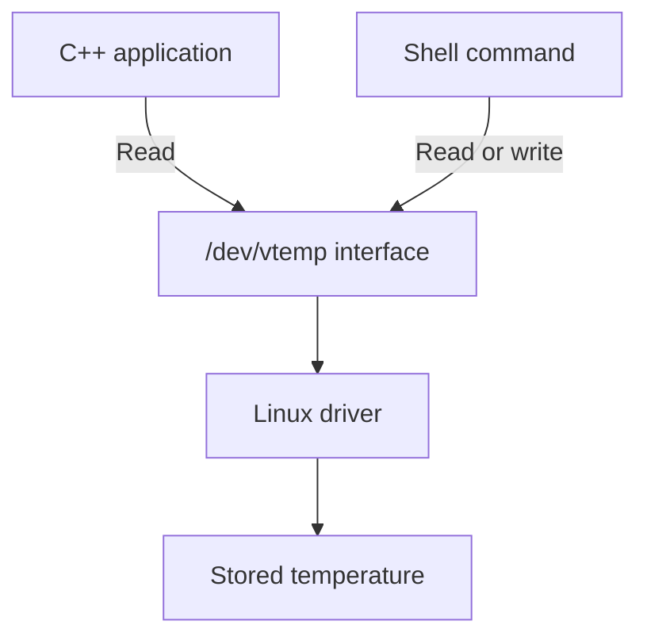
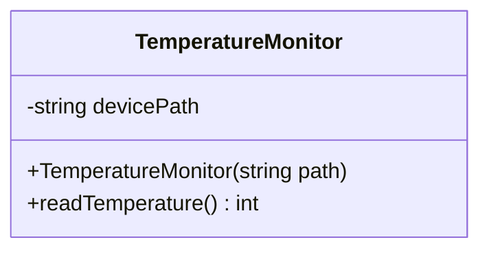
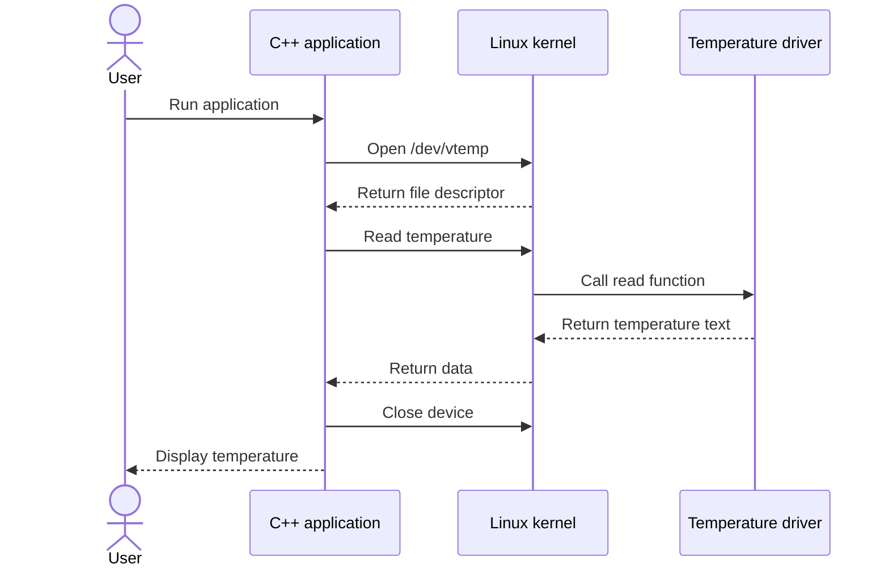
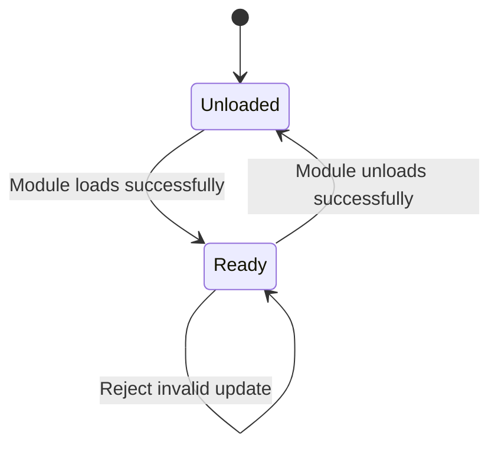

# System Design and Architecture

## 1. Project Idea
This project creates a virtual temperature sensor on Linux.

The sensor is simulated: it stores a temperature number in memory.
It does not measure the actual temperature of the laptop.

The project has two main parts:
- A Linux driver written in C that stores the temperature.
- A C++ application that reads and displays the temperature.

## 2. How the System Works
1. Load the driver into the Linux kernel.
2. The driver registers a device called /dev/vtemp.
3. The initial temperature is 25 degrees Celsius.
4. Run the C++ application to read and display it.
5. Use a shell command to change the temperature.
6. Run the application again to see the updated value.

The C++ application currently reads one value each time it runs.

## 3. System Architecture

The application and shell commands run in user space.
The driver runs in kernel space.

/dev/vtemp is the device-file interface used to access the driver.
Linux passes read and write requests to the driver's functions.

## 4. Main Components

| Component | Responsibility |
|---|---|
| driver/vtemp.c | Store temperature and handle device operations |
| app/monitor.cpp | Read and display temperature |
| driver/Makefile | Specify the kernel modules to build |
| README.md | Explain how to build and run the project |
| docs/ | Store requirements, design, progress, and test documentation |

driver/hello.c is an earlier test module used to check the environment.
It is not needed to use the temperature sensor.

## 5. Important Data

| Data | Purpose |
|---|---|
| temperature: int | Store the simulated temperature |
| temperature_lock: mutex | Protect the temperature during access |
| Local character buffers | Hold input and output text |
| file_operations structure | Connect read/write requests to driver functions |
| miscdevice structure | Describe and register the device |
| devicePath: string | Store /dev/vtemp in the C++ object |
| File descriptor: int | Identify the device opened by the application |

The temperature starts at 25 and accepts values from -40 to 125.

## 6. C++ Class Diagram

TemperatureMonitor is the application's class.

- devicePath stores the device name.
- The constructor sets the device path.
- readTemperature() reads and returns the temperature.
- main() creates the object and displays the result.

The driver uses C functions and structures, not C++ classes.

## 7. Reading Sequence

The application converts the returned text into an integer.
If an operation fails, it displays an error.

## 8. Writing a Temperature
Temperature updates currently use a shell command.

The driver:
1. Checks the input size.
2. Copies the input into a kernel buffer.
3. Converts the text into an integer.
4. Checks that it is between -40 and 125.
5. Locks the mutex, updates the value, and unlocks the mutex.

If the input is invalid, the driver returns an error and keeps
the previous temperature.

## 9. Device State Diagram

Unloaded means the device is unavailable.
Ready means the driver is registered and can handle requests.

Reloading the module resets the temperature to 25.

## 10. Safety and Error Handling
- A mutex protects the shared temperature during access.
- The driver checks input size, format, and range.
- Kernel copy helpers transfer data between user and kernel space.
- Invalid updates do not change the temperature.
- The application closes the device after reading.
- The application reports errors, such as an unavailable device.
- Device permissions are 0600, normally allowing only root access.

The mutex protects each operation separately.
It does not guarantee an unchanged value across several separate reads.

## 11. Development Environment
- Ubuntu on WSL2.
- Kernel: 6.6.87.2-microsoft-standard-WSL2.
- C for the driver and C++17 for the application.
- GCC, G++, Make, Git, and Nano.
- A compatible kernel build directory.

Build and execution commands are provided in README.md.

## 12. Development and Git Plan
The initial prototype is implemented:
1. Test module loading and unloading.
2. Register /dev/vtemp.
3. Add reading and validated writing.
4. Add the C++ application.
5. Perform basic tests and upload to GitHub.

The driver was developed on feature/temperature-driver and merged
into main. Further code changes should use a development branch
and be tested before merging.

Remaining work:
- Complete boundary and invalid-input testing.
- Test application errors and concurrent access.
- Fix any identified problems.
- Update docs/progress.md and record test results.
- Complete the report and practise the demonstration.

This design document was prepared after the initial prototype.

## 13. Concepts Demonstrated

| Topic | Example |
|---|---|
| Linux | Device files, permissions, and module commands |
| C | Functions, pointers, buffers, and structures |
| C++ | Class, constructor, encapsulation, and exceptions |
| System programming | open(), read(), write(), and close() |
| Device drivers | Device registration and read/write callbacks |
| Synchronization | Mutex |
| Computer architecture | User space and kernel space separation |
| Git | Commits, branches, merging, and GitHub |

## 14. Limitations
- No physical temperature sensor is connected.
- Only one temperature value is stored.
- The application reads once per execution.
- Shell commands are used to change the value.
- Data is lost when the module is unloaded.
- Multiple partial reads do not preserve a fixed snapshot if
  another process updates the temperature between reads.

## 15. Future Improvements
- Update the temperature from the C++ application.
- Read periodically and add temperature alerts.
- Save readings with timestamps.
- Connect a physical sensor.
